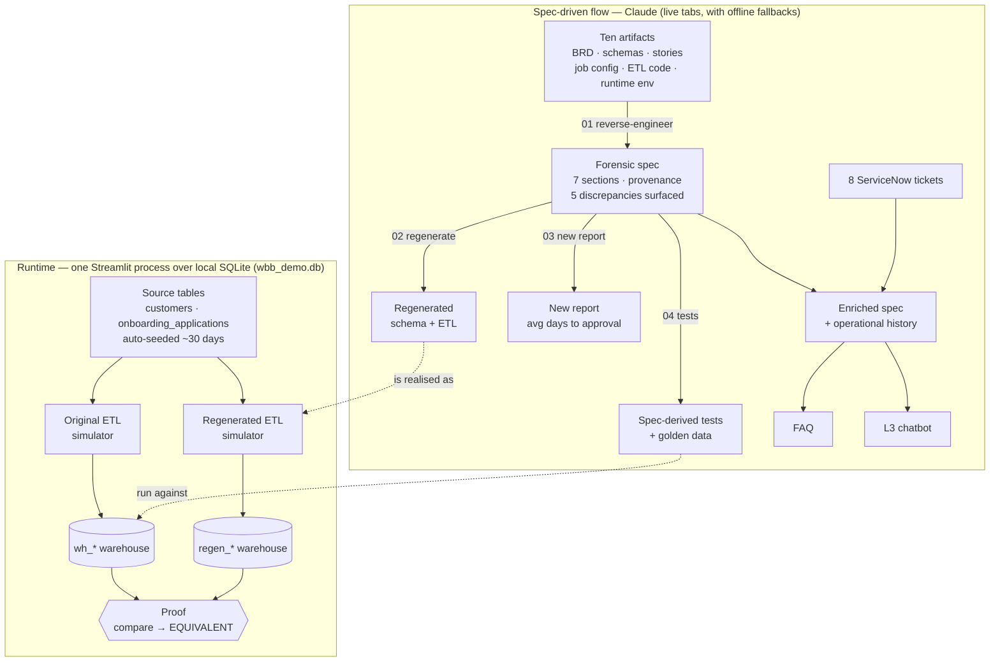

# WBB Workshop — Spec-Driven Development Demo

**Prepared by:** Frederick Ferguson, CGI  
**For:** TD Business Banking  
**Purpose:** Demonstrate the spec-driven reverse engineering method using a fictional WBB analytics warehouse

---

## Overview

A complete, runnable demonstration that a **forensic specification** — reverse-engineered from a system's own artifacts — is auditable, sufficient to regenerate the system, and durable enough to serve as an L3 support knowledge base. It runs as a single Streamlit app over a fictional web-banking onboarding platform (WBB) and its analytics warehouse (WBBAW), using no TD data or IP. The arc runs end to end: **live system → forensic spec → regeneration → proof of equivalence → new feature → production-support knowledge.**

## Key Features

- **Forensic reverse engineering** — generates a specification where every claim carries a provenance citation and contradictions are preserved, not smoothed away.
- **Five planted discrepancies** — deliberately seeded across the artifacts (including a runtime/version-drift discrepancy); the method surfaces them automatically (the centrepiece of the demo).
- **Regeneration from spec alone** — rebuilds schema + ETL from the spec with no access to the original code, then proves semantic equivalence.
- **Equivalence proof** — runs both pipelines against the same data and shows identical business outputs (the governance mechanism for drift).
- **Spec-driven extension** — adds a new analytical report straight from the spec.
- **Spec-bounded L3 chatbot** — an embedded Claude assistant that answers only from the enriched spec, classifying tickets as KNOWN PATTERN / KNOWN GAP / UNKNOWN.
- **Self-contained** — one Streamlit app over in-process SQLite; no Docker, auto-seeds its own data, and degrades gracefully to pre-built fallbacks if live generation fails.

## Contents

- [What this demonstrates](#what-this-demonstrates) — the twelve tabs
- [Prerequisites](#prerequisites) · [Setup](#setup)
- [Architecture](#architecture) — how it works
- [Running the demo](#running-the-demo) — the acts, with talk track
- [Fallback](#fallback--if-live-generation-fails)
- [The five seeded inconsistencies](#the-five-seeded-inconsistencies)
- [Key file map](#key-file-map)
- [What this is (and isn't)](#what-this-is-and-isnt)
- [Applying this to real TD work](#applying-this-to-real-td-work)
- [Rebuilding this demo elsewhere](#rebuilding-this-demo-elsewhere) — see [`rebuild.md`](rebuild.md)

---

## What this demonstrates

A complete, working demonstration of spec-driven reverse engineering. Built around a fictional web banking onboarding platform (WBB) and its analytics warehouse (WBBAW), designed to echo the structure of real modernisation work without using any TD data or IP.

The demo runs as a single Streamlit application — no Docker required.

| Tab | What it shows | What it proves |
|-----|--------------|----------------|
| 1 Live System | Customer onboarding running in-process | The source system exists and works |
| 2 Artifacts | BRD, schemas, user stories, job config, ETL code | These are the raw inputs to reverse engineering |
| 3 Spec | Forensic reverse-engineering output — live generation streams side-by-side with a reference run | Contradictions surface automatically with provenance; findings are stable run-to-run |
| 4 Regenerated | Schema + ETL rebuilt from spec alone — live generation streams side-by-side with a reference run | The spec is sufficient — original code not consulted |
| 5 Proof | Side-by-side code diff + equivalence check | Different code, identical business outputs |
| 6 New Feature | Avg-days-to-approval added from spec as launchpad | The spec enables new work, not just retrospective analysis |
| 7 Production Tickets | 8 WBB ServiceNow incidents | Production knowledge connects back to the spec |
| 8 Enriched Spec | Spec + operational history | One document serves delivery and L3 support |
| 9 FAQ | Generated from enriched spec | Knowledge made accessible without reading the spec |
| 10 L3 Chatbot | Embedded Claude chatbot | Knowledge made interactive — bounded by the spec |
| 11 Validation | Spec-derived tests + golden data | The spec defines "correct" — and can prove it |
| 12 Version Drift | Environment & version history vs. incidents | Updates cause tickets — shown, not asserted (D5) |

---

## Prerequisites

- Python 3.9+
- An Anthropic API key (for Tabs 3, 4, and 10 — live generation and chatbot)

---

## Setup

```bash
# 1. Clone the repo
git clone https://github.com/CGIDCSFred/wbb-workshop.git
cd wbb-workshop

# 2. Install dependencies
pip install -r requirements_streamlit.txt

# 3. Add your Anthropic API key
# Create .streamlit/secrets.toml with:
#   ANTHROPIC_API_KEY = "sk-ant-your-key-here"

# 4. Run the app
python -m streamlit run streamlit_app.py
```

Open **http://localhost:8501** in your browser. Use the `python -m streamlit …`
form (not a bare `streamlit run`) so the app uses the same interpreter the
dependencies were installed into.

The app seeds 30 days of synthetic onboarding data automatically on first run.

### Corporate networks (TLS inspection)

On a machine behind a TLS-inspecting proxy (e.g. Zscaler), the Anthropic SDK can
fail with `CERTIFICATE_VERIFY_FAILED` because Python's bundled CA set doesn't
include the corporate root cert. `requirements_streamlit.txt` includes
`pip-system-certs`, which makes Python trust the OS certificate store and
resolves this. If you still hit it, confirm the proxy client is healthy and its
root cert is installed in the OS trust store.

---

## Architecture

The whole demo is one process: `streamlit_app.py` over a local SQLite database
(`wbb_demo.db`). No services, no Docker.



*Top: the method — artifacts become a spec, and the spec generates everything
downstream (regeneration, a new report, tests, the enriched spec, FAQ, and the
chatbot). Bottom: the runtime — the source feeds two independently-written ETL
simulators into two warehouses that the Proof and Validation tabs compare.*

- **Source system.** On first run the app seeds ~30 days of synthetic onboarding
  applications into `onboarding_applications` / `customers`. Tab 1 reads and
  writes this live.
- **Two ETL simulators.** `run_original_etl()` and `run_regen_etl()` are
  hand-written SQLite stand-ins for the two pipelines. They read the *same*
  source tables and load two separate warehouses (`wh_*` and `regen_*`). They
  are deliberately written differently (different variable names, different
  surrogate-key formula) to model independently-authored code — while producing
  the same business outputs. This is what Tab 5 compares.
- **Live generation.** Tabs 3, 4, and 10 call the Anthropic API (`claude-sonnet-4-6`).
  Tab 3 sends `prompts/01_reverse_engineering.md` + the ten artifacts; Tab 4
  sends `prompts/02_regeneration.md` + the spec alone; Tab 10 sends the enriched
  spec as a bounded system prompt. Tabs 3/4 stream side-by-side (reference vs
  fresh run); on a network drop they fall back to `demo/fallback/`.
- **The proof.** Tab 5 runs both ETLs against the current source, then compares
  weekly volume and approval counts. Identical outputs → the green **EQUIVALENT**
  badge. This is the governance loop: regenerate, compare, and either confirm the
  spec still holds or surface a documented drift.

> **Note on layers:** the code in `artifacts/etl/` (`wbbxtr.py`, `wbbldr.py`,
> `wbb_common.py`) is the *fictional original* the reverse-engineering reads — it
> targets Postgres and is never executed. The ETL *simulators* that actually run
> live for the proof are inside `streamlit_app.py`.

---

## Running the demo

### Act 1 — The live system (Tabs 1–2, ~3 min)

**Tab 1 — Live System**  
Show the onboarding platform running. Click "Add New Application" to show it's live. Point at the KPIs.

> *"This is the source system. Business banking customers applying for WBB products. The ETL pipeline reads from this database every night."*

**Tab 2 — Artifacts**  
Flip through the artifact bundle: BRD, source schema, ETL code, and the runtime environment. These are the standard delivery outputs.

> *"When we went to understand this system, here's what we had. Looks reasonable. But does the code actually do what the BRD says?"*

---

### Act 2 — Forensic reverse engineering (Tab 3, ~6 min)

**Tab 3 — Spec**  
Click **Generate Spec Live**. Claude reads all ten artifacts and streams the forensic specification.

While it runs (~90 seconds):

> *"The prompt gives Claude five rules: provenance for every claim, discrepancies preserved not resolved, gaps named not filled, no invented details, prose throughout. These rules are what make the output a forensic specification rather than a summary."*

When it finishes, scroll to **Section 6 — Discrepancies Found**. Walk through each finding:

1. **Date column drift** — BRD §5 says count by approval date. ETL uses submission date. The reporting view is counting the wrong date.
2. **Three-name field** — BRD: `business_segment`. Source: `business_category`. Warehouse: `segment`. Three names, one concept.
3. **Done but not implemented** — WBB-AW-011 ("Capture decline reason") marked Done. Extract carries `decline_description` to staging. Load never writes it. Warehouse has no column. Found only by tracing data flow.
4. **Orphaned reference** — `job_config.yaml` runs program `wbbaudit`. No `wbbaudit.py` exists. Pipeline fails at the audit step on every run.
5. **Version drift** — a routine runtime upgrade (Python 3.10→3.12) silently destabilised the hash-based surrogate keys; the nightly load began failing with FK violations for returning customers. Found only by correlating the version history with the incident timeline (walk this in Tab 12).

> *"Five inconsistencies in a system built over five sprints by a small team. None visible from reading the BRD. They emerge from reading the code — and the runtime — as evidence."*

---

### Act 3 — Regeneration from spec alone (Tab 4, ~5 min)

**Tab 4 — Regenerated**  
Click **Regenerate from Spec**. The original artifacts are not consulted — only the spec is sent to Claude.

While it runs:

> *"The regeneration claim is only honest if the regenerator has seen nothing but the spec. If you look at the original ETL code, the claim collapses. The spec has to be sufficient on its own."*

Show the output. The code looks different from the original — different variable names, different key formula. That's expected.

---

### Act 4 — The proof (Tab 5, ~4 min)

**Tab 5 — Proof**  
Click **Compare**. Both ETLs run against the same source data. The equivalence check runs automatically.

Point at the two charts — identical weekly volumes. Point at the green badge: **EQUIVALENT**.

Scroll down to the side-by-side code view.

> *"The code looks different. The outputs are identical. This is what we mean when we say the spec is canonical."*

Deliver the governance point:

> *"Run this quarterly. Every time someone changes the production system, regenerate from the spec and click Compare. If it passes, the spec is still valid. If it fails, you have a documented drift problem — not a mystery."*

---

### Act 5 — New feature from spec (Tab 6, ~3 min)

**Tab 6 — New Feature**  
Show the feature document (Step 1: feasibility check). All data elements are already in the warehouse. No schema change needed. Click **Live Report** to show the query running.

> *"The spec told us what was already there. We didn't have to read the code. We wrote the view against the spec's documented column names."*

---

### Act 6 — Production knowledge (Tabs 7–10, ~5 min)

**Tab 7 — Production Tickets**  
Show the eight incidents. Point out that five link directly to the seeded discrepancies — D1 through D5.

> *"The spec predicted these tickets before they were raised."*

**Tab 8 — Enriched Spec**  
Show Section 8 — operational history joined to delivery knowledge in one document.

**Tab 9 — FAQ**  
Show the decline_description and column naming entries.

**Tab 10 — L3 Chatbot**  
Type: `The nightly job fails at the audit step — wbbaudit exits with program not found`  
→ **KNOWN PATTERN**, cites §8.2, gives resolution steps.

Type: `I'm trying to query fact_application for decline_description but the column doesn't exist`  
→ **KNOWN GAP**, cites §6 D3 and DEF-WBB-0048.

Type: `We're seeing a new error code PIIMASK-403 in the extract logs`  
→ **UNKNOWN — ESCALATE**

> *"The chatbot is bounded by the spec. It won't invent answers. The quality of the answers is determined by the quality of Section 8 — and Section 8 was written from evidence, not memory."*

---

### Act 7 — Validation & version drift (Tabs 11–12, ~4 min)

**Tab 11 — Validation**  
Click **Run validation suite**. The spec-derived characterization tests assert the as-built quirks (D1–D4): they pass *because* the system is as-built, and a future "fix" turns the suite red.

> *"The spec defines what 'correct' means — so it can generate the tests that prove it. This is the drift gate, made executable."*

**Tab 12 — Version Drift**  
This is the fifth discrepancy — and the one conventional review never sees. Point at the timeline: incidents per week, with the cluster at the end of April lining up with the **2026-04-28** runtime upgrade. Walk the D5 provenance chain: the surrogate-key code, the `PYTHONHASHSEED=0` override the new base image dropped, the upgrade date, and `INC-WBB-0018`.

> *"A routine security patch — no code change — broke referential integrity in the warehouse. You can only see why by putting the version history next to the incident timeline. Environment is evidence. For a migration team, this is the whole game: move the runtime, and the keys you depend on can silently change."*

---

## Fallback — if live generation fails

Pre-generated outputs are in `demo/fallback/`. If Tab 3 or Tab 4 generation is slow or fails, the tabs automatically show the fallback files — no action needed. A mid-stream network drop (e.g. a flaky corporate proxy) is caught: the tab shows a brief notice and leaves the pre-built version in place rather than surfacing an error. The Tab 10 chatbot likewise degrades to a friendly "try again" message instead of a traceback.

| Tab | Fallback location |
|-----|------------------|
| 3 Spec | `demo/fallback/wbbaw_spec_v1.md` |
| 4 Regenerated | `demo/fallback/regenerated/` |
| 6 New Feature | `demo/fallback/new_report.md` |
| 8 Enriched Spec | `demo/fallback/wbbaw_spec_section8.md` |
| 9 FAQ | `demo/fallback/wbbaw_faq.md` |

---

## The five seeded inconsistencies

These are deliberately planted. Do not fix them — they are the centrepiece of Act 2.

1. **Date column drift** — BRD §5 specifies that weekly volume counts by approval date. The ETL uses `submitted_dt` as the primary date key. `vw_weekly_onboarding_volume` counts by submission date, not approval date.

2. **Three-name field** — BRD: `business_segment`. Source schema: `business_category`. Warehouse: `segment`. Mapped correctly in the ETL, never reconciled in the BRD.

3. **Done but not implemented** — WBB-AW-011 ("Capture decline reason") is marked Done. The extract carries `decline_description` through staging. `wbbldr.py` never writes it. `fact_application` has no such column. No comment marks the absence — must be found by data flow tracing.

4. **Orphaned reference** — `job_config.yaml` step `audit` runs `wbbaudit`. No `wbbaudit.py` exists anywhere in the codebase.

5. **Version drift (D5)** — the ETL computes surrogate keys with Python's salted `hash()`, stable only while `PYTHONHASHSEED` is pinned. The legacy base image pinned it; the 2026-04-28 platform refresh (Python 3.10→3.12) dropped it, so keys for returning customers diverged and the nightly load began failing with foreign-key violations. Planted across `runtime_environment.md`, `wbbldr.py`, and `INC-WBB-0018`; discoverable only by correlating the version history with the incident timeline. Foreshadowed by the spec's own §4.4 / Q4.

---

## Key file map

| Path | What it is |
|------|-----------|
| `streamlit_app.py` | The 12-tab demo application |
| `rebuild.md` | Self-contained brief to reconstruct this demo in another environment (e.g. TD — no Docker, offline-first) |
| `requirements_streamlit.txt` | Python dependencies (`streamlit`, `pandas`, `anthropic`) |
| `.streamlit/config.toml` | Streamlit theme (TD blue) |
| `.streamlit/secrets.toml` | API key — **not committed to git** |
| `artifacts/brd_wbb_v1.1.md` | Business Requirements Document v1.1 |
| `artifacts/source_schema.sql` | WBB operational database DDL |
| `artifacts/target_schema.sql` | WBBAW warehouse DDL |
| `artifacts/user_stories_export.md` | User stories with acceptance criteria and status |
| `artifacts/job_config.yaml` | Nightly ETL job configuration |
| `artifacts/etl/wbbxtr.py` | Extract step |
| `artifacts/etl/wbbldr.py` | Load step |
| `artifacts/etl/wbb_common.py` | Shared utilities |
| `artifacts/etl/requirements.txt` | Pinned ETL runtime dependencies |
| `artifacts/runtime_environment.md` | Runtime environment + dependency/version history |
| `artifacts/servicenow_tickets_wbb.json` | 8 WBB-domain ServiceNow incidents |
| `prompts/01_reverse_engineering.md` | Reverse-engineering prompt |
| `prompts/02_regeneration.md` | Regeneration prompt |
| `prompts/03_new_report.md` | New feature prompt |
| `prompts/04_generate_tests.md` | Spec-derived test-generation prompt (Tab 11) |
| `demo/fallback/wbbaw_spec_v1.md` | Pre-built forensic spec (fallback for Tab 3) |
| `demo/fallback/regenerated/` | Pre-built regenerated artifacts (fallback for Tab 4) |
| `demo/fallback/new_report.md` | Pre-built new feature document (fallback for Tab 6) |
| `demo/fallback/wbbaw_spec_section8.md` | Operational history section (Tab 8) |
| `demo/fallback/wbbaw_faq.md` | FAQ generated from enriched spec (Tab 9) |
| `demo/fallback/test_wbbaw_from_spec.py` | Spec-derived characterization tests shown in Tab 11 |
| `spec/` | Live spec output saved here (Tab 3) |
| `regenerated/` | Live regeneration output saved here (Tab 4) |

---

## What this is (and isn't)

Being clear about scope is part of the pitch — a forensic spec is credible
precisely because it states what it does and doesn't know.

**What it is**
- A faithful demonstration of the *method*: forensic reverse engineering, regeneration, equivalence, and spec-as-knowledge-base.
- Self-contained and reproducible on a single machine.
- Honest about evidence — claims carry provenance; gaps are named, not filled.

**What it isn't**
- **Not a production system.** The WBB domain is fictional; the ETL simulators are SQLite stand-ins, not the artifact code (which targets Postgres and isn't run).
- **Not a finished spec.** The generated spec is a *forensic draft for human review* — its open questions and discrepancies are meant to be resolved with the project team before it's used as a build brief.
- **Not a universal equivalence proof.** Tab 5 proves equivalence for specific business queries (weekly volume, approval rate). A real engagement would expand the query set to the metrics that matter.
- **Not deterministic prose.** Live generations vary run-to-run in wording; the *findings* are stable, the text is not.
- **Dependent on the API for live tabs.** Tabs 3, 4, and 10 need network + an Anthropic key; everything else runs offline, and Tabs 3/4 fall back to pre-built output.

---

## Applying this to real TD work

The WBB domain is fictional; the method transfers directly. A real programme stream follows the same arc:

1. **Gather the artifacts.** Pull the existing BRD, user stories, schema DDL, ETL/job code, and config for the target system — whatever evidence exists, however incomplete.
2. **Reverse-engineer the spec.** Run `prompts/01_reverse_engineering.md`. The five rules are fixed; adapt the section structure to the system type (e.g. a migration job needs a State Machine and an Identity Model section that an ETL spec doesn't).
3. **Triage the findings.** Walk the spec's discrepancies and open questions with the project team. This is where the value lands — converting tacit knowledge and latent contradictions into a written, auditable record.
4. **Validate before cutover.** Use the spec to regenerate and run an equivalence check against the live system on the metrics that matter — your drift gate.
5. **Onboard and extend.** Hand the spec to new team members and use it as the brief for new work, instead of re-reading the code each time.
6. **Stand up L3 support.** Enrich the spec with production ticket history and front it with a spec-bounded assistant, so operational knowledge stays tied to evidence.

Run step 4 on a schedule (e.g. quarterly): a passing equivalence check confirms the spec still holds; a failing one is a *documented* drift, not a mystery.

---

## Rebuilding this demo elsewhere

To reconstruct this demo in another environment — for example inside a corporate
network with no Docker, restricted PyPI, TLS inspection, or no LLM API egress —
see **[`rebuild.md`](rebuild.md)**. It is a self-contained reconstruction brief:
hand it to a capable coding assistant and it can rebuild a semantically
equivalent demo from scratch. It covers the environment constraints and
adaptations (including an **offline-first** mode that needs no network), the data
model, the five seeded inconsistencies, the prompts verbatim, the ETL
simulators, all twelve tabs, the hard-won implementation fixes, a build sequence,
and an acceptance checklist.

---

*Prepared by Frederick Ferguson, CGI — June 2026*
